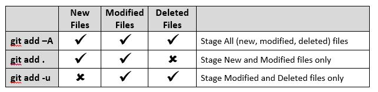

# Notas GIT

### Estados de los archivos ###

- **Committed:** Es la parte en la que nuestra información está segura alojada en nuestras bases de datos.

- **Modified:** En esta parte hemos realizado cambios en nuestros archivos, pero aún no se ven reflejados en nuestra base de datos.

- **Staged:** En esta parte marcamos nuestros archivos modificados dejándolos listos para confirmarlos.

### ¿Qué es un Sistema de Control de Versiones? ###

Un sistema que registra los cambios realizados sobre un archivo o conjunto de archivos a lo largo del tiempo. Este tipo de sistemas nos permiten volver en el tiempo y salvar nuestro trabajo.  

**Los tipos de sistemas de control son:**

**Local Computer:** Solo vive en nuestro computador.  
**Centralizado:** No depende únicamente de un computador en el que se trabaja, sino que depende del súper servidor en donde se almacena la información. El servidor provee las copias a sus hijos, pero solo guarda los cambios en un solo lugar.  
**Sistema de control distribuidos:** Cada uno de los que participan en el proyecto, tienen copia del proyecto que se realiza, por eso no dependemos de un solo computador que almacene toda la información.

> Git es un Sistema de Control de Versiones Distribuido.

### Los tres estados de Git ###

**Working Directory:** Es al lugar donde se trabajan los archivos.  
**Staging Area:** Es el área de preparación de los archivos que serán registrados en el repositorio.  
**Git Repository:** Es el lugar donde se almacena el código de forma segura.

### Comandos de Git ###

**git init:** Nos crea un repositorio de manera local y lo hará en la carpeta donde estamos posicionados o se le puede pasar ***[nombre_carpeta]*** y creará la carpeta con ese nombre.

**git status:** Muestra el estado de los archivos y directorios, los que estén en *verde* se encuentran en el *Staging Area* y los que estén *rojo* se encuentran en el *Working Directory*.

**git add [file or directory]:** Agregar un archivo o una carpeta al *Staging Area*.

**git add -A:** Agregar todos los *untracked files* al *Staging Area*

**git add .:** Agregar todos los *untracked files* al *Staging Area*

**git rm --cached [file or directory]:** Elimina un archivo o carpeta del *Staging Area* y lo deja en el *Working Directory*.

**git rm -f [file or directory]:** Fuerza la eliminación de un archivo o carpeta del *Staging Area* y del *Working Directory*.

**git checkout [file or directory]:** Revierte los cambios en un archivo o directorio dentro del *Working Directory*.

**git commit -m ["mensaje"]:** Nos permite confirmar los cambios realizados.

**git commit -m ["mensaje"] --amend:** Nos permite concatenar nuevos cambios al último y también podemos cambiar el mensaje de dicho *commit* si así lo deseamos.

**git log:** Nos permite ver el historial de todos los *commits*.

**git log --oneline:** Muestra el *id* y el título del *commit* de manera resumida y en una sola línea.

**git log -–graph:** Nos mostraria los diferentes commits en las ramas o bifurcaciones con un asterisco.

**git log -[numero]:** Nos permite limitar el número de *commits* que queremos ver.

**git log --stat:** Podemos ver los archivos que fueron cambiados en cada *commit* y explica el número de líneas que se modificaron brevemente.

**git log --decorate:** Muestra donde se encuentra el head point en el log.

**git log -p:** Explica el número de líneas que se cambiaron y te muestra que se cambió en el contenido.

**git shortlog:** Indica que commits ha realizado un usuario, mostrando el usuario y el titulo de sus commits.

**git log --graph --oneline --decorate y
git log --pretty=format:"%cn hizo un commit %h el dia %cd":** Muestra mensajes personalizados de los commits.  

**git log --after="2018-1-2":** Localizar *commits* por fechas.  
**git log --after="today":** Localizar *commits* por fechas.  
**git log --after="2018-1-2":** Localizar *commits* por fechas.
**git log --before="today":** Localizar *commits* por fechas.

**git log --author="Name Author":** Filtrar *commits* realizados por autor que cumplan exactamente con el nombre.

**git log --grep="INVIE":** Buscar los *commits* que cumplan tal cual está escrito entre las comillas.

**git log --grep="INVIE" -i:** Buscar los *commits* que cumplan sin importar mayúsculas o minúsculas.

**git log index.html:**- Buscar los *commits* en un archivo en específico.

**git log -S "Por contenido":** Buscar los *commits* con el contenido dentro del archivo.

**git tag:** Sirve para etiquetar confirmaciones.

**git diff:** Si no le pasamos ningún paramétro nos mostrará los cambios realizados entre nuestro estado actual y el último *commit.*

**git diff [HASH]:** Si le pasamos el *hash* de un *commit*, nos muestra los cambios realizados entre dicho *commit* y nuestro estado actual.

**git diff [HASH #1] [HASH #2]:** Ver los cambios realizados entre dos *commits.*

**git diff 0.5 0.3:** Ver la diferencia entre dos *tags.*

**git reset --soft [HASH]:** Partiendo de un *commit* identificado por su *HASH*, elimina todos los *commits* futuros a el y mantiene todos esos cambios (registrados en los commits eliminados) en el *Staging Area*.

**git reset --mixed [HASH]:** Partiendo de un *commit* identificado por su *HASH*, elimina todos los *commits* futuros a el y mantiene todos esos cambios (registrados en los commits eliminados) en el *Working Directory.*

**git reset --hard [HASH]:** Partiendo de un *commit* identificado por su *HASH*, elimina todos los *commits* futuros a el y ***no mantiene*** los cambios ni en el *Staging Area* ni en el *Working Directory*.

**git branch [name-branch]:** Crea una nueva rama.

**git checkout -b [name-branch]:** Crea una nueva rama y se posiciona en ella.

**git branch -l:** Lista todos las ramas que existen.

**git branch -d [name-branch]:** Elimina una rama. Con **-D** se fuerza el borrado.

**git branch -m [old-name-branch] [new-name-branch]:** Permite renombrar una nueva rama.

**git checkout [name-branch or commit-HASH]:** Permite moverse entre ramas o entre los *commits* de una rama.

**git merge [name-branch]:** Fusiona una rama con la actual (con la rama en la que nos encontramos posicionados).

**git push origin --delete <branchName>:** Elimina una rama del servidor.

**git mergetool:** Herramienta gráfica para resolver conflictos.

**git branch -v:** Lista ramas mostrando último commit.

**git branch --merged:** Lista las ramas que han sido mezcladas con la actual. Si no tienen un *, pueden borrarse, ya que significa que se han incorporado los cambios en la rama actual.

**git branch --no-merged:** Lista ramas que no han sido incorporadas a la actual.

**git stash:** Guarda el status de forma temporal (pero los archivos deben estar en el *Staging Area*).

**git stash list:** Lista los stashes.

**git stash drop stash@{#}:** Elimina un stash por medio de su ID.

**git stash apply:** Aplica el último Stash creado.

**git stash apply stash@{numero}:** Aplica el *stash* indicado por medio de su ID.

**git cherry pick [HASH]:** Mueve un commit hecho en una rama (Branch A) a otra rama (Branch B). Para eso debemos movernos a la rama a la cual queremos traer los cambios y luego ejecutar `cherry-pick`.

**git clone [SSH/HTTPS]:** Clona un repositorio desde GitHub a nuestro equipo local.

**git remote add [origin] [SSH/HTTPS]:** Conecta un repositorio con nuestro equipo local.

**git remote -v:** Lista las conexiones existentes.

**git remote remove [origin]:** Elimina una conexión con algún repositorio.

**git remote set-url [origin] [SSH/HTTPS]:** Modificar la URL del repositorio remoto. De esta manera podemos cambiar la URL del remote llamado **origin** ya que podemos tener varios remotes.

**git fetch [origin]:** Descarga cambios de GitHub y crea una rama llamada `origin/master` que luego se debe fusionar con la master de nuestro entorno local.

 

> **Untracked files:** Son archivos que no están siendo rastreados por *git*, es decir, no están en nuestro *Working Directory* ni en nuestro *Staging Area.*

  

### Notas y ejemplos ###

**git add:**  

**git tag:**

`git tag -a [1.x] -m "[descripcion]"` Registra un tag.  
`git tag -l` Lista los tags existentes.  
`git tag [1.x] [HASH commit]` Agrega un tag a un **commit** en especifico por medio de su **HASH.**  
`git tag -f -a [1.x] -m "[description...]" [Commit HASH]` Permite renombrar un tag.  
`git tag -d [1.x]` Elimina un tag.

`git log -5` Nos permite ver los últimos 5 *commits.*

**Alias - git:**

`git config --global alias.superlog "log --graph --abbrev-commit --decorate --date=relative --format=format:'%C(bold blue)%h%C(reset) - %C(bold green)(%ar)%C(reset) %C(white)%s%C(reset) %C(dim white)- %an%C(reset)%C(bold yellow)%d%C(reset)' --all"`

`git config --global alias.superlog log --color --graph --pretty=format:'%Cred%h%Creset -%C(yellow)%d%Creset%s%Cgreen(%cr) %C(bold blue)<%an>%Creset' --abbrev-commit`

Ver los *commits* de la última semana:  
`git log --all --pretty=format:'%h %cd %s (%an)' --since='7 days ago'`

Ver los *commits* de los últimos 90 días:  
`git log --all --pretty=format:'%h %cd %s (%an)' --since='90 days ago'`

**git reset --hard:** Al momento de utilizar este comando lo ideal seria hacer un respaldo del historial de nuestro proyecto ya que en caso de que algo salga mal podemos restaurar nuestros cambios.

***Recuperar cambios luego de un git reset --hard:***  
`git log > historial.txt` Realizar un respaldo de nuestos *commits.*  
`git reset --hard [HASH]` Resetear cambios hasta un *commit* especifico.  
Si nos equivocamos y queremos regresar a un *commit* que ha sido eliminado al momento de hacer `reset --hard` podemos consultar el *HASH* de dicho *commit* en nuestro archivo *historial.txt* y luego hacer `git reset --hard [HASH]` para ir al *commit* que deseamos y recuperar nuestros cambios.

**Ramas:** Una rama es una línea alterna del tiempo (del proyecto). La rama por defecto es **master**, la rama de GitHub Pages es **gh-pages** y cuando se trabaja como colaborador se identifica el proyecto principal con la rama **upstream.**

#### Mezclando ramas y resolviendo conflictos ####
En **Git** al mezclar ramas pueden pasar dos cosas, primero que la fusión se realizó con éxito **(Fast-Forward)** o que se presentaron conflictos **(Manual Merge)**.

**Fast-Forward:** Es lo que ocurre cuando se realiza un cambio en una rama y al fusionarla con otra no presenta conflictos.

**Manual Merge:** Es lo que ocurre cuando en ambas ramas se realizaran modificaciones afectando las mismas líneas de código, en este caso, **git** te pedirá que elijas con cual fragmento de código te quedarás.

  

### Enlaces de interes ###

[Emulador de terminal para Windows](http://cmder.net/)  
[Empezando con GIT](https://git-scm.com/book/es/v1/Empezando)  
[Documentation GIT](https://git-scm.com/doc)  
[Reference GIT](https://git-scm.com/docs)  
[git log](https://www.git-scm.com/docs/git-log)  
[Configurar editor de texto para git en Windows](https://help.github.com/articles/associating-text-editors-with-git/)  
[Resumen - Guia de GIT](https://joaquinaraujo.github.io/git-github/)
